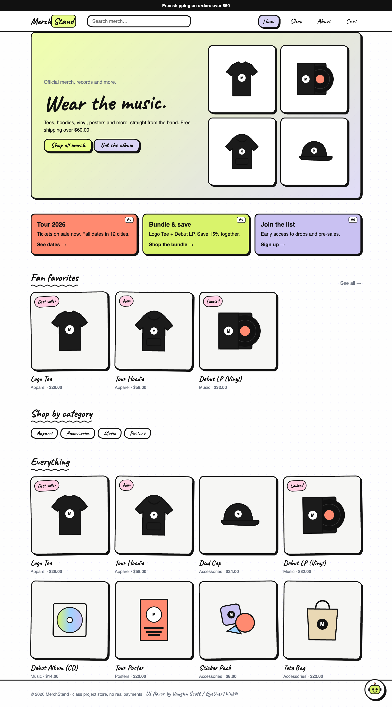
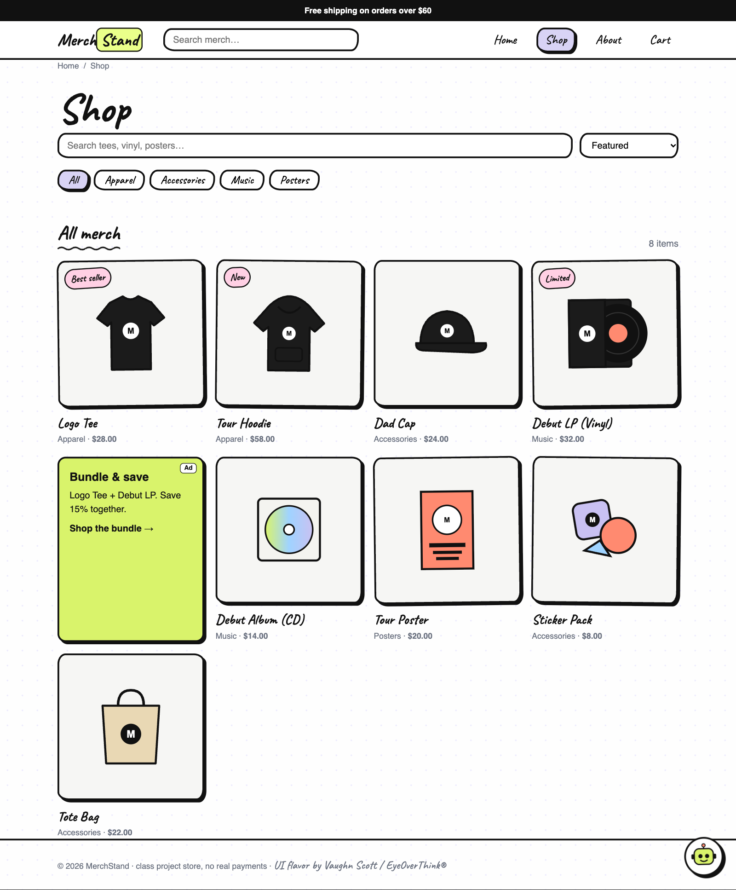
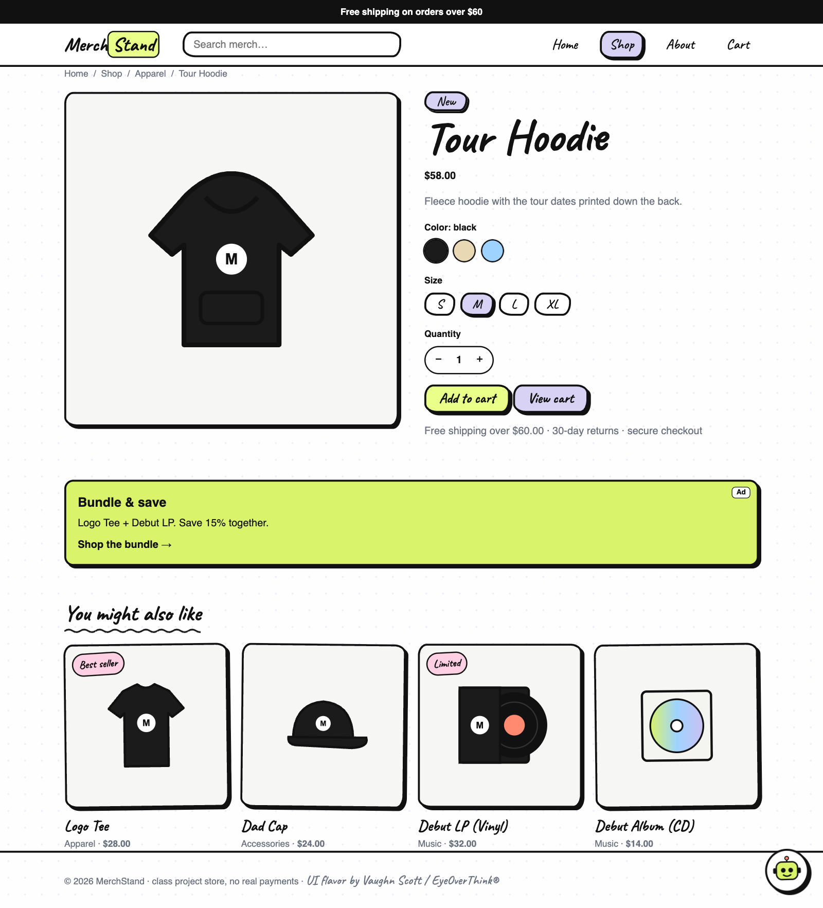
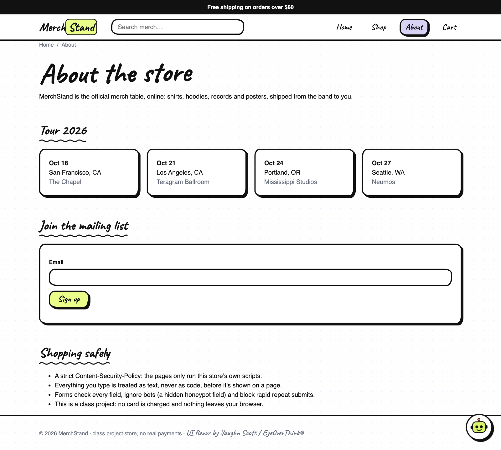
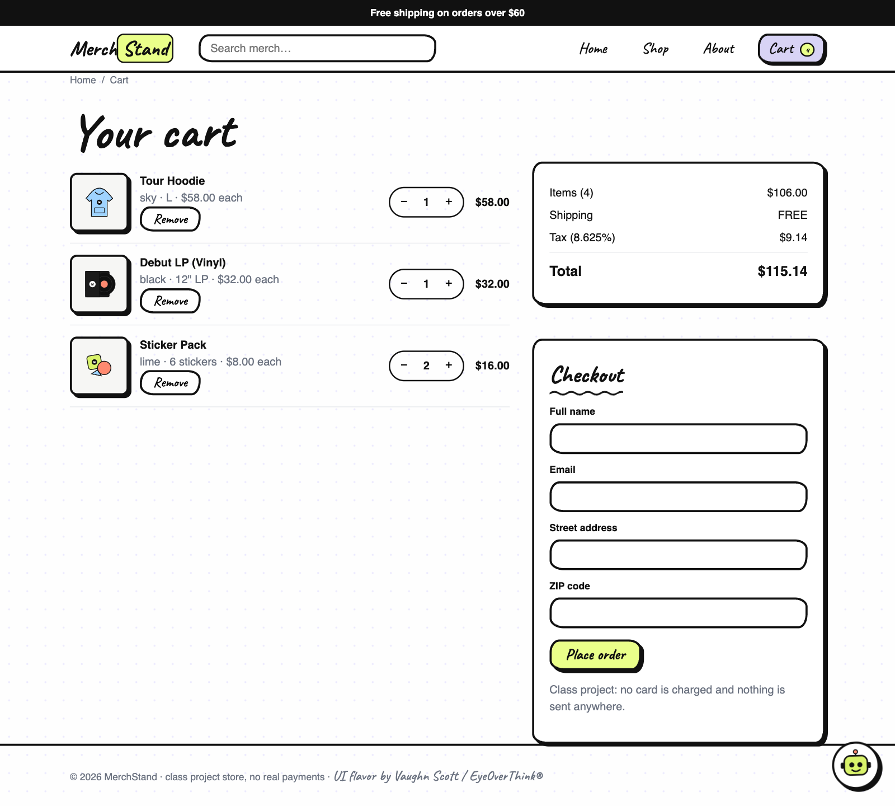
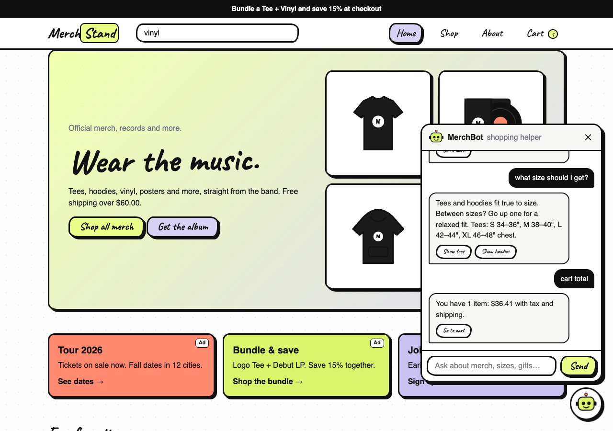

# MerchStand: Website Pages

**Team:** Willow, Alexis, Vaughn Scott · **Course:** CSC 317, Fall 2026 · SFSU
**Project:** an online merch store (tees, hoodies, vinyl, CDs, posters, stickers) built with HTML, CSS and JavaScript, served by our Express app at `/merchstand/`.

---

## 1. Home page (`index.html`)

The front door of the store.
- A rotating **announcement bar** at the top advertises deals (free shipping, bundles).
- The **header** has the logo, a **search box with instant suggestions**, and links to Shop, About and Cart (with a live item count).
- The **hero** section introduces the store with buttons to shop or get the album.
- Three **ad cards** (tour tickets, a bundle deal, the mailing list) are labeled "Ad".
- **Fan favorites**, **shop by category**, and **everything** show the products as cards.

## 2. Shop page (`shop.html`)

Where shoppers browse and filter.
- **Breadcrumbs** (Home / Shop) show where you are.
- A **search box** and a **sort menu** (featured, price low→high, high→low, A–Z).
- **Category buttons** filter the products (Apparel, Accessories, Music, Posters).
- The results update instantly, show a count, and include one **ad card** in the grid.

## 3. Product page (`product.html?id=…`)

One product with all its options.
- Pick a **color**: the product drawing changes to that color.
- Pick a **size** and a **quantity**, then **Add to cart**.
- Shipping and returns info, an ad, and **"You might also like"** suggestions.

## 4. About page (`about.html`)

The story behind the store.
- **Tour 2026** dates.
- A **mailing list** sign-up that checks the email address.
- **Shopping safely**: how the site protects shoppers.

## 5. Cart page (`cart.html`)

Review and check out.
- Each item shows its color, size and price, with **+ / −** to change quantity and **Remove**.
- The **summary** adds SF sales tax (8.625%) and shipping, which is free over $60.
- **Checkout** checks the name, email, address and ZIP before placing the order. It's a class project, so no card is charged.

## 6. MerchBot (on every page)

A chat shopping assistant in the bottom-right corner.
- It finds products ("hoodie"), suggests **gifts under a budget** ("gift under $30"), answers **size** and **shipping** questions, and can **add items to the cart** from the chat.
- It runs in the page itself, so there are no outside services or keys.

---

## Security (all pages)
- A **Content-Security-Policy** lets only the store's own scripts run.
- Everything a user types is shown as **plain text**, never run as code.
- Web-address inputs (`?id=`) only accept known products.
- Forms use a hidden **honeypot** field to stop bots and block double submits.

## Credits
Store pages, catalog, cart, search, ads, security and MerchBot: our team.
Hand-drawn UI flavor: **EyeOverThink® by Vaughn Scott** (linked from his server, not copied into the project).
