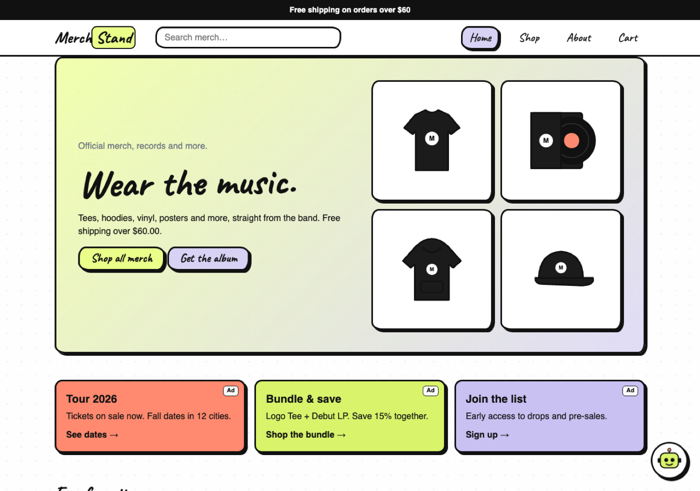
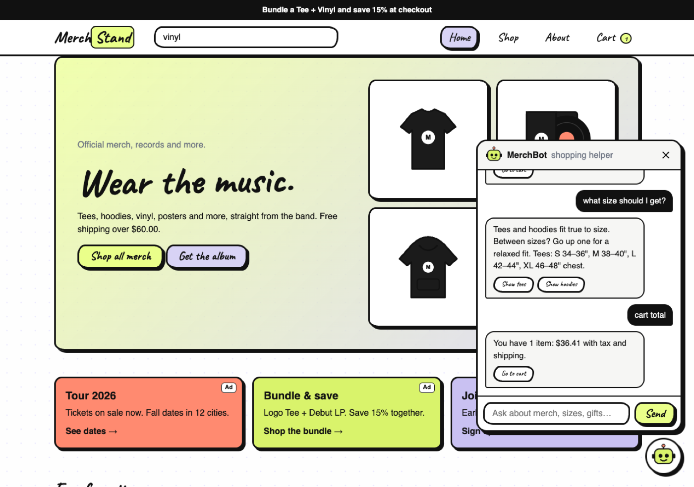

<div align="center">

# 🛍️ Merch<ins>Stand</ins>

### *Wear the music.*

Official merch, records and more: a hand-drawn, cartoon-flavored online store<br>
with live search, a chat shopping assistant and real security built in.




</div>

---

## 👋 Meet the team

| | Who |
|:-:|---|
| 🎸 | **Willow** |
| 🎤 | **Alexis** |
| 🎹 | **Vaughn Scott** |

*CSC 317 · Fall 2026 · team project*

---

## ✨ What it does

| | Feature | The short version |
|:-:|---|---|
| 🔎 | **Search** | Type in the header and suggestions pop up instantly. Full search, categories and sorting live on the Shop page. |
| 🧭 | **Navigation** | Sticky header, hamburger menu on phones, breadcrumbs on every page, category links. |
| 👕 | **Real product pages** | Pick a color (the drawing changes color), pick a size, set a quantity, add to cart. |
| 🛒 | **Cart & checkout** | Live totals with SF sales tax, free shipping over $60, and a checkout that checks every field. |
| 📢 | **Ads** | A rotating announcement bar plus in-house promo cards (tour tickets, bundles, the mailing list), each labeled **Ad**. |
| 🤖 | **MerchBot** | A chat shopping assistant in the corner. It finds merch, suggests gifts under a budget, answers size and shipping questions and **adds items to your cart from the chat**. |
| 🔒 | **Security** | Strict Content-Security-Policy, zero inline scripts, every bit of text escaped, URL inputs checked, a honeypot for bots and a resubmit guard. |
| 📱 | **Phone-ready** | Every page works on a phone, chat included. |

---

## 🤖 MerchBot in action



```text
you:       gift under $30
MerchBot:  Under $30, I'd pick: Logo Tee $28 · Dad Cap $24 · Tote Bag $22
you:       add a logo tee
MerchBot:  Added a Logo Tee (black, M) to your cart.
you:       cart total
MerchBot:  You have 1 item: $36.41 with tax and shipping.
```

No API keys and no servers: MerchBot runs right in the page.

---

## 🚀 Run it

```bash
npm install
npm start
```

Then open **http://localhost:3000/merchstand/** (Express serves everything in `public/`).

| Page | URL |
|---|---|
| 🏠 Home | `/merchstand/` |
| 🛍️ Shop | `/merchstand/shop.html` · try `?q=hoodie` or `?cat=Music` |
| 👕 Product | `/merchstand/product.html?id=tour-hoodie` |
| 🎟️ About | `/merchstand/about.html` (tour dates, mailing list, how we keep you safe) |
| 🛒 Cart | `/merchstand/cart.html` |

---

## 🔒 How it keeps shoppers safe

| Threat | What MerchStand does |
|---|---|
| Injected scripts (XSS) | A **Content-Security-Policy** lets only the store's own scripts run, and every name, search term and message is escaped before it's shown. |
| Weird URLs | `?id=` only accepts known product ids. We tested `?id=<script>…`: it's ignored and a normal product shows. |
| Spam bots | A hidden **honeypot** field that people never see; bots fill it and get dropped. |
| Double orders | Checkout refuses a second submit within 10 seconds. |
| Bad input | Name, email, address and ZIP are all checked before an order is placed. |

> Class project: no card is charged and nothing leaves your browser.

---

## 🎨 Make it yours

Everything lives at the top of **`app.js`**:

```js
const SHOP = { name: 'Merch', accent: 'Stand', tagline: 'Official merch, records and more.', freeShippingOver: 60, ... };
const PRODUCTS = [ { id: 'logo-tee', name: 'Logo Tee', price: 28, colors: [...], sizes: [...] }, ... ];
```

Rename the store, change prices, add products: the pages update themselves.

---

## 🗂️ What's inside

```text
merchstand/
├── index.html   index.js    → home
├── shop.html    shop.js     → search, filters, sort
├── product.html product.js  → options + add to cart
├── about.html   about.js    → tour, mailing list, safety
├── cart.html    cart.js     → cart + checkout
├── app.js                   → catalog, cart, search, ads, MerchBot, security helpers
├── style.css                → layout
└── screenshots/
```

---

<div align="center">

### 🖍️ Hand-drawn flavor

The cartoon, hand-drawn look comes from the **EyeOverThink® UI flavor** by **Vaughn Scott**.<br>
It's hosted and licensed for this site: linked, not copied. Please keep the `<link>` and the footer credit.

<sub>Made with ♥ by Willow, Alexis & Vaughn · CSC 317 · SFSU</sub>

</div>
